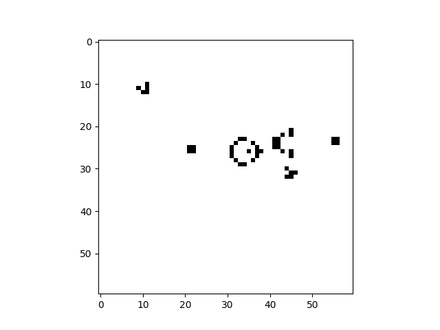

# GameOfLife with the a single kernel convolution

A simple implementation of game of life. In honour of John Coway, 1937-2020.

This is implementation performs cell update by calcualting the number of neighbours for each cell by ***convolving*** the current world-state with the "*game-of-life-kernel*".

World State:   

Game of life kernel:  

